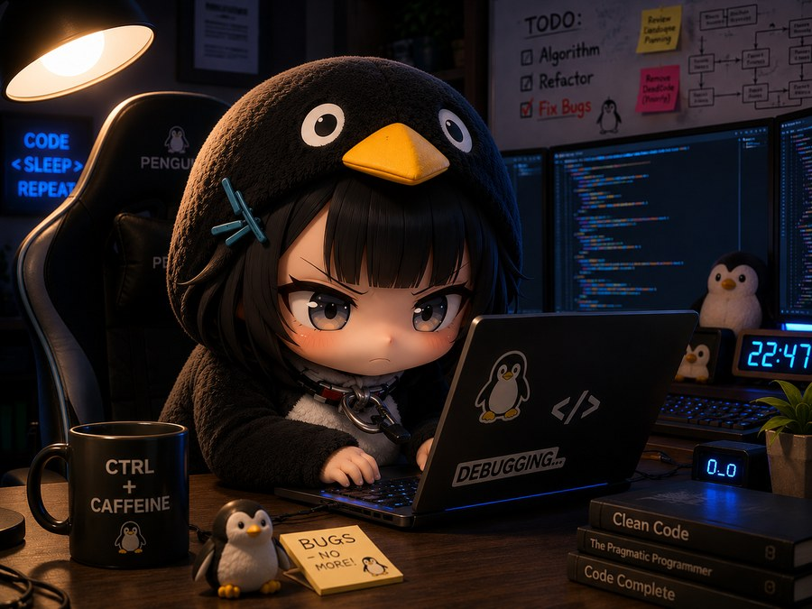

<h1>
  ¡Hola! Soy Sebastian Ayala
  
</h1>

  

<h3>
  
  Un poco sobre mí
</h3>

  Soy un estudiante de programación FullStack aprendiendo un poco sobre todo, siempre buscando autosuperarme cada dia, tomando nuevos retos constantemente

<ul>
  <li> Formándome intensivamente en <strong>Campuslands</strong>.</li>
  <li> Gran interés en el <strong>FrontEnd (UI/UX)</strong>.   
     
    </li>
  <li> Gran interés en la automatizacion de procesos via N8N </li>
  <li> <strong>Actualmente aprendiendo:</strong> Java. </li>
</ul>

<h3>
  
  Idiomas que hablo
</h3>

   <b>Español</b> (Nativo) &nbsp;&nbsp;|&nbsp;&nbsp;
   <b>Inglés</b> (C1) &nbsp;&nbsp;|&nbsp;&nbsp;
   <b>Francés</b> (B2) &nbsp;&nbsp;|&nbsp;&nbsp;
   <b>Portugués</b> (A1)

<h3 align="center">
  
  Mi Portafolio
</h3>

   
  
    
  
Desplegado en un <strong>VPS propio autogestionado</strong> desplegado con <strong>Coolify</strong> y <strong>Docker</strong>.

  
Puedes visitarlo aquí:

  

<h3 align="center">
  
  Tecnologías y Herramientas
</h3>

   
  <h4>Lenguajes de Programación</h4>
  
  
  
  
  
  

    
  <h4>Herramientas, Entorno y Despliegue</h4>
  
  
  
  
  
    

<h3 align="center">
  
  Estadísticas de GitHub
</h3>

  

 

  

